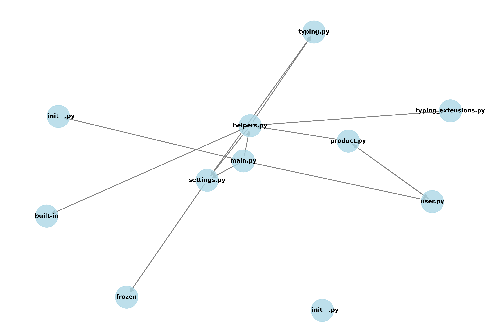

# Codebase Analyzer

A Python tool for analyzing codebases, identifying dependencies, and generating comprehensive reports using LLM-powered analysis.

## Features

- Codebase parsing and dependency graph generation
- Dead code analysis
- LLM-powered code analysis
- Visualization of dependencies
- JSON-based reporting

## Project Structure

```
codebase_analyzer/
├── src/
│   ├── analyzer/
│   │   ├── __init__.py
│   │   ├── codebase_parser.py
│   │   ├── llm_context.py
│   │   ├── dead_code_analyzer.py
│   │   └── codebase_agent.py
│   ├── utils/
│   │   └── __init__.py
│   └── main.py
├── tests/
├── docs/
├── pyproject.toml
└── README.md
```

## Installation

1. Clone the repository:
```bash
git clone <repository-url>
cd codebase_analyzer
```

2. Install dependencies using Poetry:
```bash
poetry install
```

## Usage

The analysis process consists of two steps:

1. First, run the main script to parse the codebase and generate the context:
```bash
poetry run python src/main.py <path_to_codebase>
```

2. Then, run the codebase agent to perform the LLM analysis:
```bash
poetry run python src/analyzer/codebase_agent.py
```

### Example: Test Project Analysis

For the test project, the dependency graph shows the following relationships:



The graph above shows:
- `main.py` as the central entry point
- Dependencies between various modules like `typing.py`, `helpers.py`, and `settings.py`
- Module relationships and import chains
- Built-in Python imports and frozen modules

Key observations:
- `helpers.py` is a central module with multiple dependents
- `typing_extensions.py` and `typing.py` provide type support
- `settings.py` is referenced by multiple modules
- Clean separation between utility modules and business logic

## Output Files

- `data/llm_context.json`: Contains the prepared context for LLM analysis
- `data/llm_analysis.json`: Contains the LLM's analysis of the codebase
- `data/dependency_graph.png`: Visualization of the codebase dependencies
- `data/raw_response.txt`: Debug file containing the raw LLM response

## Development

### Running Tests
```bash
poetry run pytest tests/
```

### Adding New Features
1. Create a new module in `src/analyzer/`
2. Add tests in `tests/`
3. Update documentation in `docs/`

